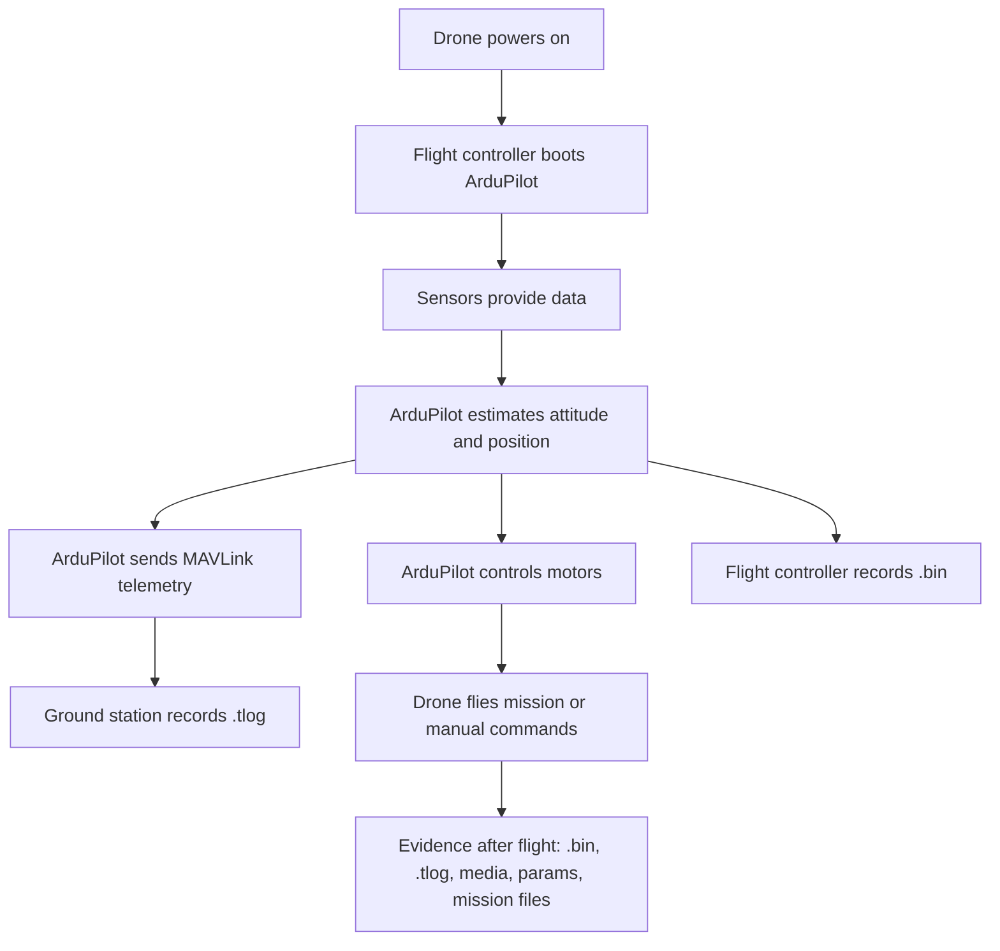

# Drone Ecosystem 101

This page explains the parts of a simple ArduPilot-style drone and why each part matters for forensics.

For a visual pass before the terminology, see the [Visual Glossary](02-visual-glossary.md).

## Basic Components

### Airframe

The physical body of the drone: quadcopter, hexacopter, fixed wing, rover, boat, or sub. For this project, assume a multicopter first because airport/no-fly-zone analysis is easiest to understand with a flying drone.

### Flight Controller

The onboard computer that stabilizes and controls the vehicle. It reads sensors, estimates position, runs flight modes, sends outputs to motors/servos, and writes onboard logs.

Common ArduPilot-compatible flight controllers include Pixhawk-class boards and many other autopilot boards.

For forensics, the flight controller is important because it may contain:

- Onboard DataFlash logs.
- Firmware/version information.
- Parameters.
- Mission and geofence settings.
- Sensor health and failsafe events.

### Sensors

Typical sensors:

- IMU: accelerometer and gyroscope.
- GPS/GNSS: latitude, longitude, altitude, ground speed, time.
- Compass/magnetometer: heading reference.
- Barometer: air pressure and altitude estimate.
- Rangefinder: distance to ground or obstacle, if installed.
- Battery monitor: voltage, current, consumed capacity.

For forensics, GPS and time are usually the most important first. IMU, barometer, battery, and estimator state help validate or challenge the reconstruction.

### Motors, ESCs, and Servos

The flight controller sends commands to motor controllers or servos. Some logs include output values and ESC telemetry.

For forensics, output data can help answer:

- Was the vehicle armed?
- Were motors commanded?
- Was the drone trying to climb, land, or return?
- Did outputs look abnormal near an incident?

### Radio Control Link

The RC transmitter and receiver carry pilot stick commands. ArduPilot logs may include RC inputs.

For forensics, RC inputs can help distinguish:

- Manual pilot action.
- Autonomous mission behavior.
- Failsafe behavior after RC loss.

### Telemetry Link

Telemetry is the data link between the drone and the ground station. It may run over USB, telemetry radio, Wi-Fi, LTE, or other transport.

ArduPilot commonly uses MAVLink over this link.

For forensics, telemetry can produce a `.tlog` on the ground-station computer.

### Ground Control Station

The ground station is software used to configure, monitor, and control the drone.

Common tools:

- Mission Planner.
- QGroundControl.
- MAVProxy.

For forensics, the ground station may contain:

- `.tlog` telemetry logs.
- Parameter files.
- Mission/waypoint files.
- Operator-side timestamps.
- Map/replay data.

### Payload and Media

Payloads include cameras, gimbals, thermal sensors, radios, and companion computers.

Flight logs usually do not contain the photos/videos themselves. Media should be collected separately and correlated with the flight path by timestamp.

## Data Flow



## Forensic Questions

A simple forensic app should answer:

- What kind of aircraft was this?
- Which autopilot generated the log?
- When did the flight happen?
- Where did the drone fly?
- How high did it fly?
- Did GPS quality support the claim?
- Was it manual, assisted, or autonomous?
- Did it enter a restricted area?
- What evidence supports each conclusion?

## Beginner Vocabulary

```text
FC        Flight Controller
GCS       Ground Control Station
MAVLink   Common drone telemetry protocol
GPS/GNSS  Satellite positioning system
IMU       Accelerometer + gyroscope sensor package
EKF       Estimator that fuses sensors into position/attitude
RTL       Return to Launch
Loiter    Position-hold flight mode
Auto      Mission/autonomous flight mode
```
