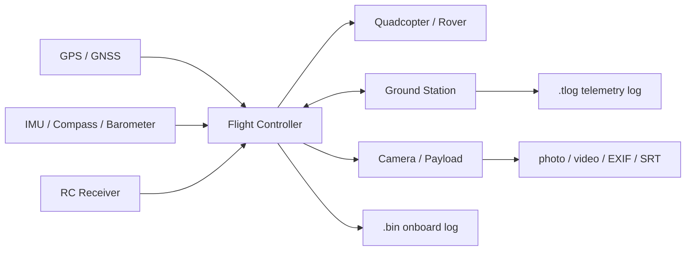

# Visual Glossary

This page gives you a fast visual map of the drone ecosystem. The images are external reference images from Wikimedia Commons, so this repo stays lightweight.

## Quadcopter

A quadcopter is a four-rotor multicopter. In ArduPilot terms, this is usually an `ArduCopter` vehicle.

For forensics, a quadcopter can produce:

- Onboard `.bin` DataFlash logs.
- Ground-station `.tlog` telemetry logs.
- GPS/position/altitude records.
- Battery, motor output, and mode-change records.
- Camera media if a payload is installed.

Attribution: [Quadcopter landing at Head of the Charles.agr.jpg](https://commons.wikimedia.org/wiki/File:Quadcopter_landing_at_Head_of_the_Charles.agr.jpg), Wikimedia Commons.

## Rover / Ground Vehicle

A rover is an unmanned ground vehicle. ArduPilot can run `Rover` firmware for wheeled or tracked vehicles.

For forensics, rover logs are similar in structure to aircraft logs, but the movement is ground-based:

- Latitude/longitude path.
- Speed and heading.
- Mode changes.
- RC input and steering/throttle outputs.
- GPS quality and mission data.

Attribution: [Lagr-robot.jpg](https://commons.wikimedia.org/wiki/File:Lagr-robot.jpg), Wikimedia Commons.

## Flight Controller

The flight controller is the onboard computer that runs the autopilot. Pixhawk-class boards are common in ArduPilot/PX4 ecosystems.

For forensics, this is one of the most important devices because it may contain or generate:

- Onboard `.bin` logs.
- Firmware and board version information.
- Parameters.
- Mission and geofence settings.
- Sensor health and failsafe events.

Attribution: [Pixhawk.png](https://commons.wikimedia.org/wiki/File:Pixhawk.png), Wikimedia Commons.

## GPS / GNSS Module

The GPS/GNSS module gives position, ground speed, satellite count, and often time. Some drone GPS modules also include a compass.

For forensics, GPS is central because it supports:

- Flight path reconstruction.
- Launch/home/landing/last-known position.
- Speed and heading checks.
- No-fly-zone intersection checks.
- Confidence scoring from fix type, satellite count, and accuracy fields.

Attribution: [GPS ublox NEO-M6 Antenne.jpg](https://commons.wikimedia.org/wiki/File:GPS_ublox_NEO-M6_Antenne.jpg), Wikimedia Commons.

## IMU Sensor

An IMU combines accelerometers and gyroscopes. Many systems also combine magnetometer data. ArduPilot fuses these measurements with GPS and barometer data to estimate attitude and position.

For forensics, IMU-related data helps answer:

- Was the vehicle moving or vibrating heavily?
- Did attitude match the claimed flight behavior?
- Were there estimator or vibration problems?
- Did the flight path contain suspicious jumps?

Attribution: [A Noitom IMU sensor.jpg](https://commons.wikimedia.org/wiki/File:A_Noitom_IMU_sensor.jpg), Wikimedia Commons.

## RC Receiver / Control Link

The RC receiver carries pilot control inputs from a transmitter to the flight controller. This is different from the telemetry link, although some systems support telemetry too.

For forensics, RC-related logs can help distinguish:

- Manual pilot input.
- Autonomous mission behavior.
- RC failsafe.
- Commanded throttle, yaw, roll, pitch, steering, or mode-switch behavior.

Attribution: [FrSky X8R 2.4GHz receiver.jpg](https://commons.wikimedia.org/wiki/File:FrSky_X8R_2.4GHz_receiver.jpg), Wikimedia Commons.

## How These Parts Map to Evidence

The first ArduPilot forensic app should focus on `.bin`, `.tlog`, parameters, missions, and media timestamps.

