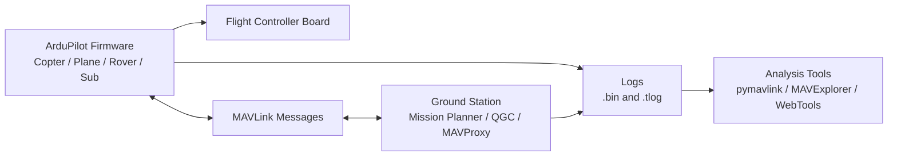

# ArduPilot 101

ArduPilot is an open-source autopilot software platform. It can run different vehicle firmwares, including Copter, Plane, Rover, and Sub.

For this forensics project, start with ArduCopter because the first target is a simple drone flight path and no-fly-zone check.

## What ArduPilot Does

ArduPilot:

- Reads sensors.
- Estimates attitude and position.
- Runs flight modes.
- Controls motors and servos.
- Communicates with a ground station over MAVLink.
- Logs flight data onboard.
- Supports missions, geofences, failsafes, and return-to-launch behavior.

## ArduPilot Ecosystem



## ArduPilot vs MAVLink

ArduPilot is the autopilot software.

MAVLink is a message protocol used by ArduPilot, PX4, ground stations, companion computers, and other drone systems.

Think of it like this:

```text
ArduPilot = the vehicle brain
MAVLink   = the language used to talk to/from the vehicle
```

## Ground Stations

### Mission Planner

Mission Planner is a Windows-focused ArduPilot ground station. It can configure the vehicle, plan missions, view live telemetry, download logs, replay telemetry logs, extract parameters and waypoints, and graph log data.

### QGroundControl

QGroundControl is a cross-platform ground station for MAVLink vehicles. It supports ArduPilot and PX4 workflows and can load `.tlog` telemetry logs.

### MAVProxy

MAVProxy is a command-line MAVLink ground station and router. It is useful for scripting, companion-computer setups, and log tools.

## Flight Modes

Flight mode matters in forensics because it gives context for pilot intent and autopilot behavior.

Common Copter modes:

- `Stabilize`: pilot controls attitude, no GPS position hold.
- `AltHold`: autopilot holds altitude, pilot controls position.
- `Loiter`: GPS position hold.
- `RTL`: return to launch.
- `Auto`: follows mission waypoints.
- `Guided`: controlled by GCS or companion computer commands.
- `Land`: automated landing behavior.

In logs, mode changes are important event markers. A no-fly-zone report should show where the drone was during each mode.

## Parameters

Parameters are persistent configuration values. They control vehicle setup, flight modes, failsafes, geofence settings, battery settings, logging settings, and many other behaviors.

For forensics, parameters can answer:

- Was geofence enabled?
- What failsafe behavior was configured?
- Which flight modes were assigned?
- Was logging enabled?
- What altitude or RTL settings were configured?

Important parameter families to inspect later:

```text
LOG_*
FENCE_*
FS_*
BATT_*
RTL_*
FLTMODE*
SERIAL*
GPS*
COMPASS*
ARMING_*
```

## Why ArduPilot Is Good for a First Forensic MVP

ArduPilot is a good first scope because:

- The project and docs are open.
- MAVLink is documented.
- `.tlog` telemetry logs are parseable.
- DataFlash `.bin` logs are parseable.
- `pymavlink` gives Python access to both formats.
- Public sample logs are available from ArduPilot autotest.

The first app can avoid proprietary DJI extraction and still prove the forensic workflow.

