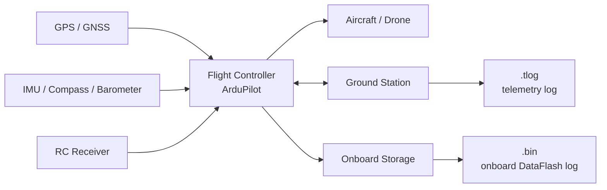
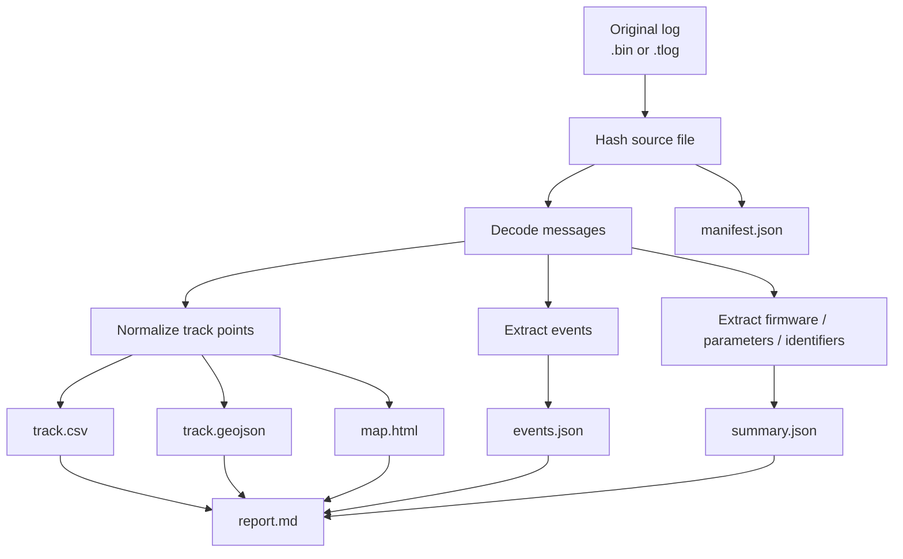
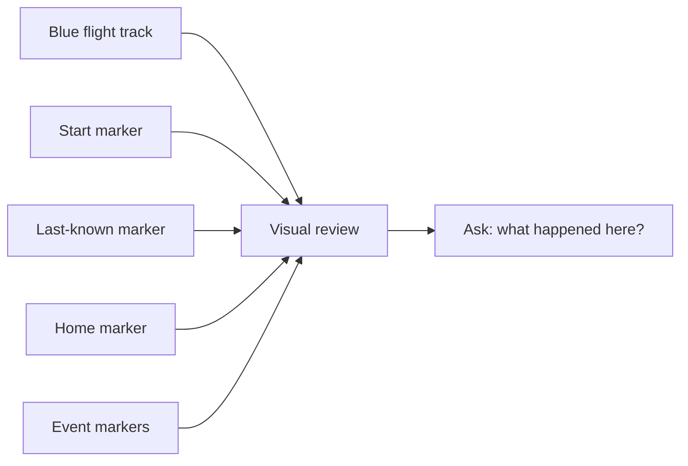

# ArduPilot Log Field Guide

This guide is for the moment when you open an Anveshan `report.md`, `map.html`,
`events.json`, or `track.csv` and see terms like `WP`, `RTL`, `EKF`, `MODE`, `PARM`,
`.tlog`, and `.bin`.

You do not need to know MAVLink or ArduPilot internals first. Start with the big picture:

```text
What flew?
Where did it fly?
When did it fly?
What mode was it in?
What warnings or failures were recorded?
How strong is the evidence?
```

## Visual Mental Model

The drone creates evidence from several physical parts.


Attribution: [Quadcopter landing at Head of the Charles.agr.jpg](https://commons.wikimedia.org/wiki/File:Quadcopter_landing_at_Head_of_the_Charles.agr.jpg), Wikimedia Commons.



For a first review:

- `.bin` usually tells you what the flight controller recorded onboard.
- `.tlog` tells you what the ground station or telemetry receiver saw.
- Both are useful. If they disagree, treat that as an analysis point, not as noise to hide.

## Evidence To Artifacts

Anveshan turns source evidence into derived artifacts.



The original evidence should remain unchanged. The artifacts are derived outputs and should
be traceable through `manifest.json`.

## First Five Files To Open

| File | Open It For |
| --- | --- |
| `report.md` | Human-readable case summary |
| `map.html` | Visual route, start/end/home markers, and event markers |
| `track.csv` | Spreadsheet/pandas review of every normalized position |
| `events.json` | Timeline of mode changes, mission messages, warnings, arming/disarming |
| `quality-warnings.json` | Reasons to lower confidence or inspect more carefully |

Use `parsed_messages.ndjson` when you need raw decoded message traceability. It can be large.

## Reading `map.html`

The map is a quick visual review, not a final conclusion.



Common map features:

| Map Feature | Meaning |
| --- | --- |
| Blue line | Extracted flight path |
| Start marker | First normalized track point |
| Last-known marker | Last normalized track point |
| Home marker | Home/launch reference when the log exposes it |
| Event marker | Nearest track location for a mode/status/error/mission event |
| Popup | Timestamp, mode, altitude, source sequence, and event summary |

If `--map-tiles none` was used, the map still has Leaflet overlays but no base map tile
layer. Use `--map-tiles openstreetmap` for easier sample visualization. For sensitive
evidence, `--map-tiles none` avoids external tile requests.

## `.tlog` Versus `.bin`

| Question | `.tlog` | `.bin` |
| --- | --- | --- |
| Where was it recorded? | Ground station / telemetry receiver | Flight controller onboard storage |
| Format | MAVLink packet stream | ArduPilot DataFlash records |
| Strong for | What the ground side saw, commands, telemetry stream | Onboard reconstruction, sensors, mode/events |
| Common risk | Telemetry dropouts or late logging | Requires aircraft/storage access; logging may be disabled |
| Parser output kind | `mavlink_tlog` | `ardupilot_bin` |

Practical rule: if you have both for the same flight, parse both and compare timelines,
home position, last-known position, mode changes, and GPS quality.

## Common Mission Terms

These are the terms that often show up in `events.json`, `report.md`, and map popups.

| Term | Plain Meaning | How To Read It |
| --- | --- | --- |
| `WP` | Waypoint | A GPS target in an uploaded mission |
| `Mission: 2 WP` | Mission item 2 is a waypoint | The vehicle is following mission item 2 |
| `Reached command #2` | Command 2 completed | ArduPilot considered that mission item done |
| `RTL` | Return To Launch | Vehicle returns toward home/launch position |
| `Mission: 50 RTL` | Mission item 50 is return-to-launch | RTL was part of the mission sequence |
| `Takeoff` | Automatic takeoff | Mission-controlled takeoff behavior |
| `Land` | Automatic landing | Mission or mode requested landing |
| `SplineWP` | Curved waypoint | Smoothed path between mission points |
| `LoitTurns` | Loiter turns | Circle/hold around a point for configured turns |

Example sequence:

```text
Mode changed to GUIDED
Mode changed to AUTO
Mission: 1 Takeoff
Mission: 2 WP
Reached command #2
Mission: 50 RTL
Mission: 51 Land
DISARMED
```

Beginner reading: the log supports an automated mission with takeoff, waypoints,
return-to-launch, landing, and disarm. It does not by itself prove who planned the mission.

## Common Flight Modes

| Mode | Plain Meaning | What To Inspect |
| --- | --- | --- |
| `STABILIZE` | Manual attitude control | RC inputs, pilot-control context |
| `ALT_HOLD` | Altitude hold | Altitude behavior and climb/descent |
| `LOITER` | GPS position hold | GPS quality and hold location |
| `AUTO` | Uploaded mission execution | Mission events, waypoints, geofence/failsafe settings |
| `GUIDED` | Commands from GCS/companion computer | Command messages and GCS source |
| `RTL` | Return to launch | Home position, RTL parameters, reason for RTL |
| `LAND` | Automated landing | Landing location, `LAND_COMPLETE`, disarm |
| `BRAKE` | Quick stop/hold | Avoidance/failsafe/pilot command context |

Do not overread a mode name. `RTL` means return-to-launch was active. It does not say why
unless nearby events, parameters, or commands support the reason.

## Common Event Labels

| Event | Meaning |
| --- | --- |
| `ARMED` | Vehicle armed; motors/actuators could run |
| `AUTO_ARMED` | Vehicle armed as part of automatic behavior |
| `DISARMED` | Vehicle disarmed |
| `SET_HOME` | Home position was set in DataFlash context |
| `HOME_POSITION` | MAVLink home/launch position message |
| `NOT_LANDED` | Vehicle state changed away from landed |
| `LAND_COMPLETE_MAYBE` | Possible landing detected |
| `LAND_COMPLETE` | Landing considered complete |
| `FAILSAFE_OR_RECOVERY_EVENT` | Failsafe/recovery-related marker; inspect nearby messages |
| `BAD_DATA` | Telemetry decoder found invalid/corrupt MAVLink data |

When reviewing a possible incident, read 30-60 seconds of events before and after the marker.

## Common Message And Record Names

### MAVLink `.tlog`

| Message | Meaning |
| --- | --- |
| `HEARTBEAT` | Vehicle/autopilot type, mode, armed state |
| `AUTOPILOT_VERSION` | Firmware, board/version fields, capabilities, UID fields when sent |
| `SYSTEM_TIME` | UTC/boot time mapping |
| `GLOBAL_POSITION_INT` | Main position, altitude, velocity, heading |
| `GPS_RAW_INT` | GPS fix, satellites, accuracy hints |
| `VFR_HUD` | User-facing speed, altitude, heading |
| `HOME_POSITION` | Home/launch point |
| `BATTERY_STATUS` / `SYS_STATUS` | Battery and system state |
| `EKF_STATUS_REPORT` | Estimator confidence/status |
| `STATUSTEXT` | Human-readable autopilot messages |
| `PARAM_VALUE` | Parameter value sent over telemetry |
| `COMMAND_LONG` / `COMMAND_ACK` | Command and acknowledgement |

### DataFlash `.bin`

| Record | Meaning |
| --- | --- |
| `VER` | Firmware/build/board fields |
| `PARM` | Parameters at log time |
| `MSG` | Human-readable autopilot text |
| `MODE` | Flight mode changes |
| `EV` | Arming, disarming, home, failsafe-related events |
| `ERR` | Subsystem error records |
| `GPS` | GPS fix, position, speed, satellites |
| `POS` | Estimated position and relative altitude |
| `BAT` | Battery voltage/current/remaining |
| `IMU` | Accelerometer/gyroscope data |
| `MAG` | Magnetometer/compass data |
| `RCIN` | Pilot RC input |
| `RCOU` | Motor/servo outputs |

## Sensor And System Abbreviations


Attribution: [GPS ublox NEO-M6 Antenne.jpg](https://commons.wikimedia.org/wiki/File:GPS_ublox_NEO-M6_Antenne.jpg), Wikimedia Commons.

| Abbreviation | Meaning | Why It Matters |
| --- | --- | --- |
| `GPS` / `GNSS` | Satellite positioning | Track, UTC time, speed, heading |
| `EKF` | Extended Kalman Filter | Fuses GPS/IMU/barometer/compass into position/attitude estimate |
| `IMU` | Inertial Measurement Unit | Accelerometer and gyroscope data |
| `MAG` | Magnetometer/compass | Heading/yaw estimation |
| `BARO` | Barometer | Altitude and climb-rate context |
| `RC` | Radio control | Pilot input and RC failsafe context |
| `GCS` | Ground Control Station | Mission Planner, QGroundControl, MAVProxy, scripts |
| `SITL` | Software-In-The-Loop | Simulation/test environment indicator |
| `MAV` | MAVLink system/vehicle reference | Protocol IDs and source systems |

## Firmware And Identifier Fields


Attribution: [Pixhawk.png](https://commons.wikimedia.org/wiki/File:Pixhawk.png), Wikimedia Commons.

Logs can expose firmware and identifier-like fields. Treat these as trace fields, not pilot
identity.

| Field | Where It Appears | Meaning |
| --- | --- | --- |
| `firmware_string` | `VER` in `.bin` | ArduPilot firmware name/version string |
| `git_hash_hex` | `VER` in `.bin` | Firmware build git hash in hex form |
| `flight_sw_version_text` | `AUTOPILOT_VERSION` in `.tlog` | Decoded flight software version |
| `uid` / `uid2` | `AUTOPILOT_VERSION` in `.tlog` | Hardware UID fields when sent |
| `uid_candidates` | DataFlash startup `MSG` | UID-like text found in startup messages |
| `BRD_SERIAL_NUM` | `PARM` / `PARAM_VALUE` | Board serial parameter; often unset as `0` |
| `BATT_SERIAL_NUM` | `PARM` / `PARAM_VALUE` | Battery serial parameter; often unset as `-1` |
| `SYSID_THISMAV` | `PARM` / `PARAM_VALUE` | MAVLink vehicle system ID |
| `SYSID_MYGCS` | `PARM` / `PARAM_VALUE` | Expected ground-station system ID |
| `COMPASS_DEV_ID*` | `PARM` / `PARAM_VALUE` | Compass device IDs |
| `INS_ACC_ID` / `INS_GYR_ID` | `PARM` / `PARAM_VALUE` | Accelerometer/gyroscope device IDs |

Interpretation rules:

- `0`, `-1`, empty strings, and missing fields usually mean unset/default.
- A UID-like value may help correlate logs or hardware, but does not identify a pilot.
- Firmware version helps reproduce parser behavior and understand supported log fields.
- Device IDs can help compare whether two logs likely came from the same configured vehicle.

## Parameters Worth Checking First

| Parameter Family | Why It Matters |
| --- | --- |
| `FLTMODE*` | Mode-switch assignments |
| `FENCE_*` | Geofence enabled state, radius, altitude, fence action |
| `FS_*` | Failsafe thresholds and actions |
| `RTL_*` | Return-to-launch altitude and behavior |
| `BATT_*` | Battery monitoring and low/critical failsafe thresholds |
| `LOG_*` | Logging configuration |
| `GPS*` | GPS configuration |
| `SERIAL*` | Telemetry/serial port configuration |
| `ARMING_*` | Arming checks and requirements |
| `BRD_*` | Board configuration and serial parameter |
| `INS_*` / `COMPASS*` | Sensor configuration and device IDs |
| `SYSID_*` | MAVLink vehicle/GCS IDs |

## Quality Warnings

Quality warnings are not failures. They are confidence notes.

| Warning Pattern | What It Means |
| --- | --- |
| Missing UTC | The parser could not confidently map boot time to wall-clock UTC |
| Sparse track | Too few position points for strong route reconstruction |
| Weak GPS fix | Some points were recorded before a strong fix |
| Low satellite count | GPS confidence may be reduced |
| Missing home position | Launch/home point was not recorded or not found |
| Impossible jump | Position changed faster than expected, likely bad GPS or data issue |
| Bad data | Telemetry contained corrupt/invalid MAVLink packets |

Forensic reports should preserve these warnings instead of hiding them.

## Beginner Review Workflow

Use this order when opening a new parsed log:

1. Open `manifest.json` and confirm source hash exists.
2. Open `report.md` and read evidence, parser, vehicle, and warnings.
3. Open `map.html` and inspect start, end, home, and event markers.
4. Open `events.json` and scan mode changes, mission text, arming/disarming, errors.
5. Open `track.csv` if you need exact timestamps, altitude, speed, and GPS quality rows.
6. If something is suspicious, inspect matching rows in `parsed_messages.ndjson`.

Ask these questions:

- Did the log start before takeoff and end after landing?
- Is there a home position?
- Is there a strong GPS fix through the relevant period?
- Did the vehicle enter `AUTO`, `GUIDED`, `RTL`, or `LAND`?
- Are there `ERR`, failsafe, battery, GPS, or EKF warnings near the event?
- Are UTC timestamps present, or only boot-relative timestamps?
- Are the firmware and identifier fields present or missing/default?

## Safe Language For Reports

Use evidence-grounded wording:

- Good: "The log records `AUTO` mode at this time."
- Good: "The extracted track intersects this area between these timestamps."
- Good: "The log contains a UID-like startup message; treat it as an identifier candidate."
- Avoid: "The pilot intentionally entered restricted airspace."
- Avoid: "This serial number proves ownership."
- Avoid: "No violation occurred" when GPS/time/zone data is incomplete.

The goal is to report what the evidence supports, what is uncertain, and what should be
checked next.
