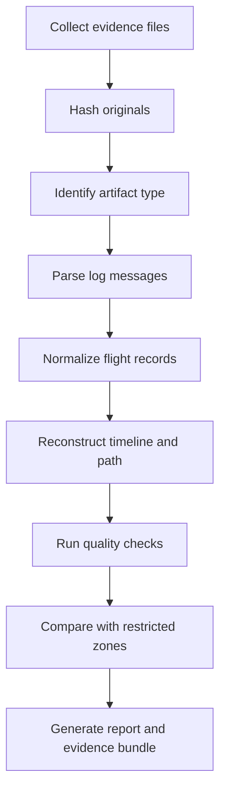

# UAV Forensics 101

The forensic app should be evidence-first. It should not just parse logs; it should explain how each conclusion was reached.

For the full analyst workflow, see [Standard Forensic Analysis Flow](../user_flow/01-standard-forensic-analysis-flow.md).

## Core Rule

Do not modify original evidence.

For every file:

1. Copy it into a case folder.
2. Compute SHA256.
3. Record file size and collection time.
4. Parse only from the preserved copy.
5. Hash derived outputs too.

## Simple Case Folder

```text
case-001/
  originals/
    ArduCopter-test.tlog
    sample-arducopter.bin
  derived/
    track.csv
    track.geojson
    events.json
    case-summary.json
  reports/
    report.md
  chain-of-custody.md
```

## Forensic Pipeline



## What We Can Prove From ArduPilot Logs

Usually strong:

- Vehicle type and autopilot type from telemetry heartbeat.
- Flight path from GPS/position messages.
- Altitude from position, GPS, and barometer messages.
- Speed and heading.
- Flight mode changes.
- Battery state.
- GPS quality.
- Autopilot warnings and errors.

Sometimes available:

- Firmware version.
- Board information.
- Board serial parameter or hardware UID candidates.
- IMU, compass, and GPS device identifiers.
- Parameters.
- Geofence settings.
- Mission waypoints.
- Camera trigger events.
- Gimbal information.
- RC input and motor output.

Usually not inside the log:

- Actual photos or videos.
- Pilot identity.
- Confirmed owner identity.
- Legal authorization records.
- Legal authorization status.
- Full intent.
- All ground-station UI actions.

Treat firmware, serial parameters, and UID-like fields as trace evidence. They can help link
logs, hardware, and parser artifacts, but they do not by themselves identify a pilot or prove
authorization status. Values such as `0`, `-1`, or blank strings often mean unset/default.

## No-Fly-Zone Analysis

The first useful rule check is:

```text
Did the reconstructed flight path intersect a restricted polygon during an active time window, and at what altitude?
```

Inputs:

- Normalized flight track.
- Zone polygons.
- Zone active time windows.
- Altitude floors/ceilings.
- Optional authorization evidence.

Outputs:

- Entry time.
- Exit time.
- Duration inside zone.
- Max altitude inside zone.
- Distance traveled inside zone.
- Evidence message references.
- Confidence and warnings.

## Confidence Model

The app should not output only `violation=true`. It should also explain confidence.

High confidence:

- Good GPS fix.
- Dense position messages.
- Reliable UTC time.
- Clear zone source/version.
- Agreement between `.bin` and `.tlog`.

Lower confidence:

- No UTC time.
- Sparse telemetry.
- Low satellite count.
- GPS jumps.
- Missing `.bin`.
- Only ground-station `.tlog` available.
- Zone layer date/version unknown.

## Minimal Outputs

For the MVP, generate:

```text
case-summary.json
track.csv
track.geojson
events.json
quality-warnings.json
report.md
```

## Report Shape

A useful report should include:

- Case ID and evidence hashes.
- Parser versions.
- Vehicle summary.
- Flight start/end time.
- Launch/home/landing/last-known positions.
- Map path.
- Altitude profile.
- Event timeline.
- Quality warnings.
- Restricted-zone results.
- Clear statement of limitations.

## Important Limitation

Logs are evidence, not the full story. They can show what the drone recorded or transmitted. They cannot by themselves prove who operated the drone, whether authorization existed, or what media was captured unless those artifacts are also collected and correlated.
