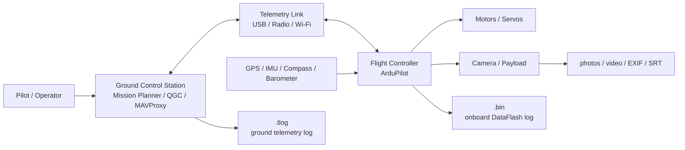

# Drone and ArduPilot 101

This folder is the beginner learning path for the project. It assumes no prior drone or ArduPilot knowledge.

## Reading Order

1. [Drone Ecosystem 101](01-drone-ecosystem-101.md)
   - Hardware parts of a drone.
   - Ground station, telemetry, flight controller, sensors, payload.

2. [Visual Glossary](02-visual-glossary.md)
   - What a quadcopter, rover, flight controller, GPS, IMU, and RC receiver look like.
   - Which evidence each physical part can produce.

3. [ArduPilot 101](03-ardupilot-101.md)
   - What ArduPilot is.
   - What MAVLink is.
   - How Mission Planner, QGroundControl, MAVProxy, and logs fit together.

4. [Logs 101: `.tlog` and `.bin`](04-logs-101.md)
   - What telemetry logs and onboard DataFlash logs are.
   - Which messages matter for forensics.
   - How to inspect sample logs.

5. [ArduPilot Log Field Guide](05-ardupilot-log-field-guide.md)
   - How to read `report.md`, `map.html`, `events.json`, and `track.csv`.
   - What `WP`, `RTL`, `AUTO`, `GUIDED`, `EKF`, `PARM`, `VER`, and `MODE` mean.
   - How to interpret firmware, serial parameters, UID candidates, and quality warnings.

6. [Forensics 101](06-forensics-101.md)
   - How to preserve evidence.
   - How to reconstruct a flight.
   - What a simple no-fly-zone check needs.

7. [Useful Links](07-useful-links.md)
   - Official docs and tools worth keeping nearby.

## Mental Model

For forensics, the core idea is simple: preserve every artifact, parse what you can, normalize it into a common flight track, and only then run rule checks.
