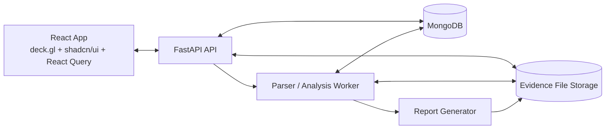

# Initial FastAPI / MongoDB / React Architecture

This architecture supports the user flow where analysts create rules, create cases, upload UAV logs, select rule versions, and run forensic analysis.

## High-Level System



## Main Backend Modules

```text
app/
  api/
    cases.py
    evidence.py
    rules.py
    analysis.py
    reports.py
  domain/
    evidence.py
    rules.py
    tracks.py
    violations.py
  services/
    hashing.py
    storage.py
    parsers/
      ardupilot_tlog.py
      ardupilot_bin.py
    rule_engine.py
    report_builder.py
  workers/
    parse_worker.py
    analysis_worker.py
```

## MongoDB Collections

```text
cases
evidence_files
parse_jobs
parsed_messages
normalized_track_points
rule_sets
rule_set_versions
zones
analysis_runs
violation_events
reports
audit_events
users
```

Use GeoJSON geometry for:

- Zone polygons.
- Flight tracks.
- Violation segments.
- Home/launch/landing points.

## API Shape

First endpoints:

```text
POST   /cases
GET    /cases
GET    /cases/{case_id}
POST   /cases/{case_id}/evidence
GET    /cases/{case_id}/evidence
POST   /cases/{case_id}/parse
GET    /cases/{case_id}/tracks

POST   /rule-sets
GET    /rule-sets
POST   /rule-sets/{rule_set_id}/versions
POST   /rule-sets/{rule_set_id}/versions/{version}/activate
GET    /rule-sets/{rule_set_id}/versions/{version}

POST   /cases/{case_id}/analysis-runs
GET    /cases/{case_id}/analysis-runs
GET    /analysis-runs/{analysis_run_id}
GET    /analysis-runs/{analysis_run_id}/violations

POST   /analysis-runs/{analysis_run_id}/reports
GET    /reports/{report_id}
```

## Frontend Screens

```text
Cases
  Case list
  Case detail
  Evidence upload
  Parse status
  Track map
  Analysis runs
  Report review

Rules
  Rule-set list
  Rule-set detail
  Polygon drawing/import
  Version review
  Activate/retire version

Map Review
  Flight track layer
  Rule zone layer
  Violation segment layer
  Timeline slider
  Altitude/speed chart
```

## deck.gl Layers

Useful starting layers:

- `GeoJsonLayer` for zones.
- `PathLayer` for flight track.
- `ScatterplotLayer` for track points and events.
- `TextLayer` for zone labels.
- Later, `TripsLayer` for replay animation.

## Rule Engine Contract

Input:

```text
case_id
track_version
rule_set_id
rule_set_version
analysis_engine_version
```

Output:

```text
analysis_run
violation_events
quality_warnings
summary
```

Do not mutate prior analysis runs. New rules or new parsers should produce new analysis runs.

## Important Implementation Principle

For forensic defensibility, derived data must always trace back to:

- Original evidence file hash.
- Parser version.
- Rule-set version.
- Analysis engine version.
- Report version.

