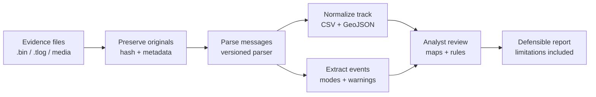

<section class="anveshan-hero" markdown>

# Anveshan Docs

Anveshan is a UAV forensics project for preserving drone evidence, parsing ArduPilot logs,
reconstructing flight tracks, and producing defensible reports with clear limitations.

  <a class="anveshan-button primary" href="101_doc/">Start Beginner 101</a>
  <a class="anveshan-button secondary" href="101_doc/05-ardupilot-log-field-guide/">Read Log Field Guide</a>

</section>

## Start Here

If you are new to drones or ArduPilot logs, read the beginner docs in this order:

1. [Drone Ecosystem 101](101_doc/01-drone-ecosystem-101.md)
2. [Visual Glossary](101_doc/02-visual-glossary.md)
3. [ArduPilot 101](101_doc/03-ardupilot-101.md)
4. [Logs 101: `.tlog` and `.bin`](101_doc/04-logs-101.md)
5. [ArduPilot Log Field Guide](101_doc/05-ardupilot-log-field-guide.md)
6. [Forensics 101](101_doc/06-forensics-101.md)
7. [Useful Links](101_doc/07-useful-links.md)

## Main Sections

  <a class="anveshan-card" href="101_doc/">
    <strong>Beginner 101</strong>
    Drone basics, ArduPilot concepts, log formats, parser output, and forensic terms.
  </a>
  <a class="anveshan-card" href="user_flow/">
    <strong>User Flows</strong>
    Analyst workflows for evidence review, rule authoring, and case analysis.
  </a>
  <a class="anveshan-card" href="architecture/">
    <strong>Architecture</strong>
    Implementation-facing notes for the API, web app, parser engine, and storage model.
  </a>
  <a class="anveshan-card" href="plans/uav-forensics-app-plan/">
    <strong>Plans</strong>
    Product and implementation plan for the UAV forensics application.
  </a>

<strong>Evidence rule:</strong> preserve the original evidence, make every derived artifact
traceable, and only report what the evidence supports.

## Core Mental Model

