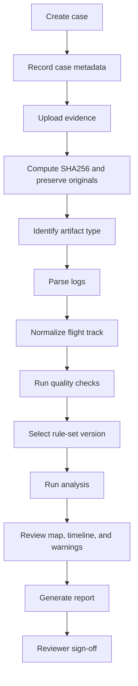
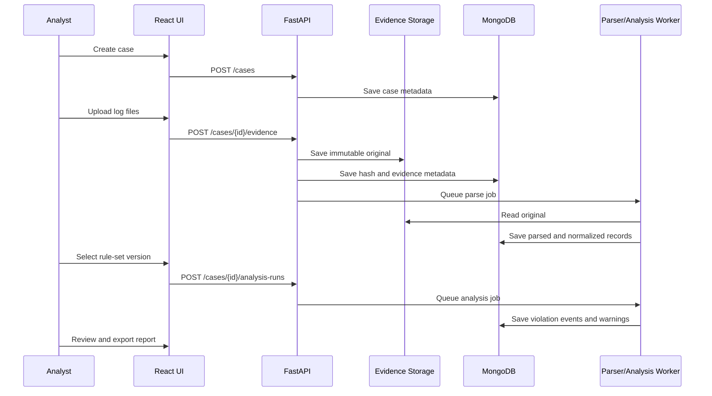

# Standard Forensic Analysis Flow

This app should follow an evidence-first workflow. The goal is not to automatically declare guilt. The goal is to preserve evidence, extract facts, apply selected rules, and produce a defensible report.

NIST SP 800-86 describes digital forensic activity around collection, examination, analysis, and reporting. This app should follow the same spirit for UAV evidence.

Reference:

```text
https://csrc.nist.gov/pubs/sp/800/86/final
```

## Roles

### Analyst

The analyst creates cases, uploads evidence, chooses rule sets, reviews extracted tracks, runs analysis, and writes findings.

### Rule Manager

The rule manager creates and maintains reusable no-fly-zone / restricted-zone rule sets. In a small team, this can be the same person as the analyst.

### Reviewer

The reviewer checks evidence, parser warnings, selected rules, analysis results, and report wording before release.

### Administrator

The administrator manages users, permissions, storage, data retention, and trusted data-source connectors.

## Case Flow



## Step 1: Create Case

Required metadata:

- Case title.
- Case owner.
- Incident location if known.
- Incident date/time if known.
- Jurisdiction or organization.
- Case purpose: airport violation, sensitive-site incident, hobbyist safety review, training, or other.

The case should have a stable case ID before evidence upload.

## Step 2: Upload Evidence

Supported first:

- ArduPilot `.bin` logs.
- MAVLink `.tlog` logs.
- Media files and metadata later.
- Rule/zone files later.

Each uploaded file becomes an evidence item.

Evidence item fields:

```text
evidence_id
case_id
original_filename
storage_uri
sha256
size_bytes
uploaded_by
uploaded_at
declared_source
detected_type
parser_status
notes
```

## Step 3: Preserve Originals

Do not parse by modifying the original file. Store originals as immutable artifacts and parse into derived records.

Minimum preservation:

- Compute SHA256.
- Record file size.
- Record upload timestamp.
- Record uploader.
- Record parser version when extraction runs.

## Step 4: Parse and Normalize

The parser extracts raw log messages and converts them into a common schema:

```text
timestamp_utc
lat_deg
lon_deg
alt_msl_m
alt_relative_m
groundspeed_m_s
heading_deg
source_message_type
source_system
source_component
gps_fix_type
satellites_visible
raw_message_ref
```

The app should keep raw parsed records and normalized records separate.

## Step 5: Quality Checks

Before rule analysis, the app should show quality warnings:

- Missing UTC time.
- Weak or missing GPS.
- Sparse track points.
- Impossible speed jumps.
- Altitude discontinuities.
- Missing takeoff/landing period.
- `.tlog` telemetry gaps.
- `.bin` logging gaps.
- Parser errors or unsupported messages.

Quality warnings affect confidence. They do not automatically invalidate the evidence.

## Step 6: Select Rules

The analyst selects a rule-set version for the case.

Examples:

- FAA airport/controlled-airspace rule set from a dated import.
- Temporary security restriction rule set from a NOTAM/TFR snapshot.
- Military base perimeter rule set created by the organization.
- Local training/test rule set.
- Hobbyist safety review rule set.

The selected rule version must be locked into the analysis run.

## Step 7: Run Analysis

The analysis engine compares the normalized flight track against selected rules.

Analysis output:

```text
analysis_run_id
case_id
rule_set_id
rule_set_version
track_version
started_at
completed_at
engine_version
violation_events
quality_warnings
confidence_summary
```

## Step 8: Review Results

The analyst should review:

- Map path.
- Zone intersections.
- Entry/exit times.
- Altitude during each intersection.
- GPS quality at the relevant time.
- Rule source and effective date.
- Parser warnings.
- Any authorization evidence.

## Step 9: Report

The report should state:

- What evidence was analyzed.
- Hashes of original files.
- Which parser and versions were used.
- Which rules were selected.
- Rule source, version, and effective date.
- Whether the track intersects any selected restricted zones.
- Confidence and limitations.

Use careful language:

```text
The extracted flight track intersects Zone A under Rule Set X version Y.
```

Avoid unsupported legal conclusions:

```text
The pilot is guilty.
```

## Forensic Flow Diagram



