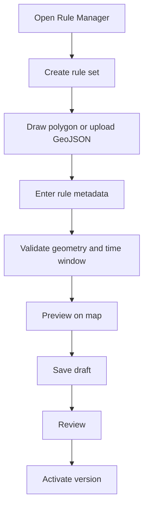
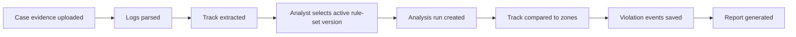
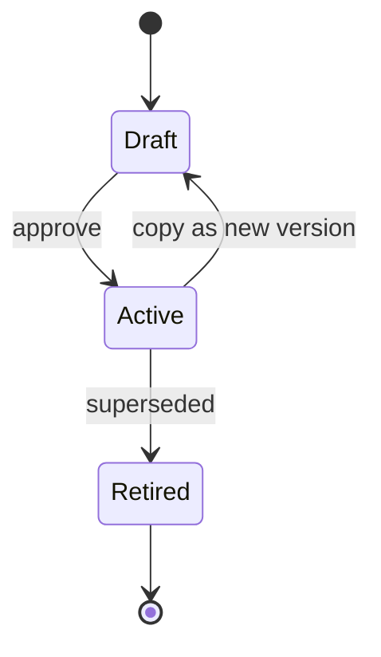

# Rule Authoring and Case Selection

Yes: the app should allow forensic analysts or rule managers to provide the rules for no-fly zones and restricted zones.

This is the right product model because:

- Rules change over time.
- Rules differ by country, agency, terrain, altitude, and mission type.
- Sensitive-site boundaries may be private.
- The app cannot know every current local regulation in advance.
- A forensic report must say exactly which rules were applied.

The app should treat rules as versioned evidence/configuration, not hard-coded application logic.

## Rule Sources

Supported rule sources should include:

- Manually drawn polygons.
- Uploaded GeoJSON.
- Uploaded KML/Shapefile later.
- Imported official datasets later.
- Organization-private restricted areas.
- Temporary event/security restrictions.
- Authorization records attached to a case.

For the US, FAA sources are examples of official data that may be imported later:

- UAS Facility Maps.
- LAANC / FAA UAS Data Exchange context.
- TFRs and NOTAMs.
- Special Use Airspace.
- Airport/airspace classes.

References:

```text
https://www.faa.gov/uas/commercial_operators/uas_facility_maps
https://www.faa.gov/uas/getting_started/laanc
https://www.faa.gov/uas/getting_started/temporary_flight_restrictions
```

## Rule-Set Model

A rule set is a named collection of zones and conditions.

Example:

```text
rule_set_id: rs_airport_training_001
name: Airport Training Rules
jurisdiction: US / training
owner_org: Anveshan Demo
status: draft | active | retired
version: 1
created_by: analyst@example.com
created_at: 2026-06-01T00:00:00Z
source_notes: Created for test analysis using demo polygons.
```

Rule sets must be versioned. Editing an active rule set should create a new version, not mutate old case history.

## Zone Model

Each zone should be a GeoJSON feature with forensic metadata.

```json
{
  "type": "Feature",
  "geometry": {
    "type": "Polygon",
    "coordinates": []
  },
  "properties": {
    "zone_id": "zone_airport_001",
    "name": "Airport 5 km test zone",
    "rule_type": "no_fly_zone",
    "altitude_floor_m": 0,
    "altitude_ceiling_m": 121.92,
    "altitude_reference": "AGL",
    "effective_from": "2026-06-01T00:00:00Z",
    "effective_to": null,
    "authority": "Demo",
    "source_url": null,
    "source_document_hash": null,
    "confidence": "analyst_defined",
    "notes": "Training polygon drawn by analyst."
  }
}
```

## Rule Types

Start simple:

```text
no_fly_zone
altitude_ceiling
altitude_floor
time_window_restriction
sensitive_site_buffer
airport_grid
warning_zone
authorization_required
```

The MVP can implement only:

- Polygon intersection.
- Time-window filtering.
- Altitude ceiling check.

## Analyst Rule Authoring Flow



Required metadata before activation:

- Name.
- Rule type.
- Geometry.
- Altitude reference: AGL, MSL, relative-to-home, unknown.
- Effective start time.
- Effective end time or ongoing flag.
- Authority/source.
- Created by.
- Version.

Optional but recommended:

- Source URL.
- Source document upload.
- Source document hash.
- Review notes.
- Jurisdiction.
- Tags.

## Case Analysis Flow With Rules



The case should store:

```text
selected_rule_set_id
selected_rule_set_version
selected_at
selected_by
analysis_engine_version
```

This prevents a future rule edit from changing old reports.

## Manual Polygon Drawing Rules

Drawing polygons is acceptable for:

- Organization-private restricted areas.
- Training/demo cases.
- Military/sensitive-site perimeters supplied by the authority.
- Temporary local event boundaries.
- Terrain-specific buffers.

But the app should make the provenance clear:

```text
Source: analyst-drawn
Authority: user-provided
Confidence: depends on supplied documentation
```

For official/legal reports, analyst-drawn zones should be backed by a source document, map, order, NOTAM, authorization, or agency-provided boundary file.

## Rule Versioning

Never overwrite rules used by a past analysis.

Use this lifecycle:



Case reports should include:

- Rule set name.
- Rule set ID.
- Rule set version.
- Zone IDs.
- Source URLs or source document hashes.
- Analysis timestamp.

## Backend Model Notes

FastAPI + MongoDB fits this workflow well.

Suggested collections:

```text
cases
evidence_files
parse_jobs
normalized_track_points
rule_sets
rule_set_versions
zones
analysis_runs
violation_events
reports
audit_events
users
```

Use GeoJSON for zone geometry and track geometry. MongoDB can store GeoJSON and support geospatial indexes for rule lookup.

## Frontend Model Notes

React + deck.gl is a good fit for:

- Viewing extracted flight tracks.
- Drawing/editing polygons.
- Rendering restricted zones.
- Rendering violation segments.
- Time slider playback.
- Altitude and speed overlays.

shadcn/ui can handle:

- Case forms.
- Rule metadata forms.
- Tables for evidence, rule versions, and violation events.
- Review dialogs.

React Query can handle:

- Case list and details.
- Evidence upload state.
- Parse job status.
- Rule-set versions.
- Analysis job polling.
- Report download status.

## Product Recommendation

For MVP, build rules as user-managed datasets first. Later, add official-data connectors.

MVP order:

1. Draw/import polygon.
2. Add altitude/time metadata.
3. Activate rule-set version.
4. Create case and upload ArduPilot logs.
5. Select rule-set version.
6. Run analysis.
7. Review and export report.

This is simpler, defensible, and works across countries without pretending the app knows every current regulation.

