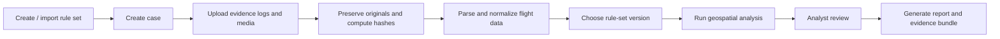

# User Flow

This folder describes how a forensic analyst should use the app.

## Recommended Reading

1. [Standard Forensic Analysis Flow](01-standard-forensic-analysis-flow.md)
2. [Rule Authoring and Case Selection](02-rule-authoring-and-case-selection.md)

## Product Direction

The app should not hard-code every no-fly-zone rule for every country. Rules change, jurisdictions differ, and some sensitive-site boundaries may be private.

The standard approach is:

- Analysts or administrators create versioned rule sets.
- Rule sets can be drawn on a map, uploaded as GeoJSON/Shapefile/KML later, or imported from official data connectors.
- Each case chooses a specific rule-set version before analysis.
- Analysis output records exactly which rule version was used.
- Reports say "possible violation under selected rules", not "legal guilt".

## High-Level Flow

